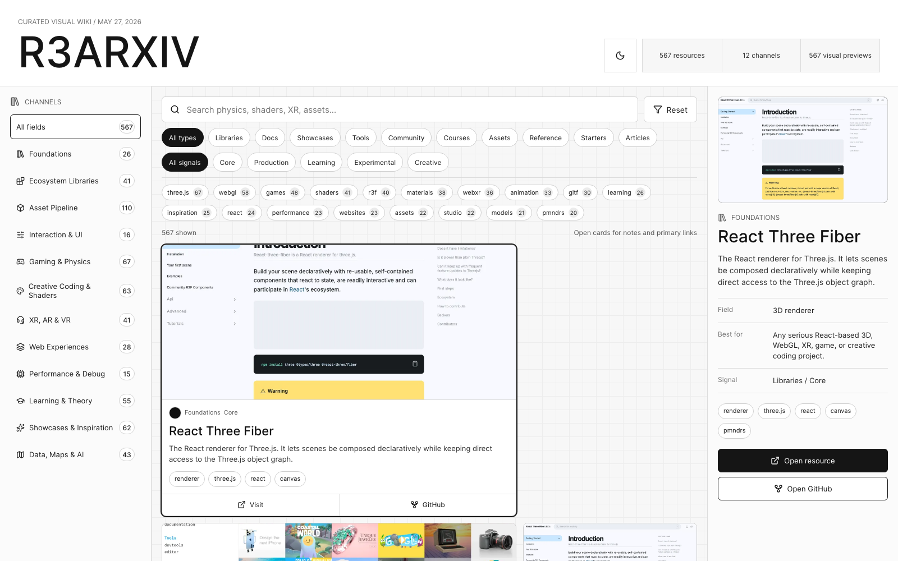

```text
........
                         +#@@@@@@@@@@@@@@@@@%#
                    :*@@@@@@@@@@@@@@@@@@@@@@@@@@@+
                 :%@@@@@@@@@@@@@@@@@@@@@@@@@@@@@@@@@:
               #@@@@@@@@@@@@@@@@@@@@@@@@@@@@@     @@@@:
             %@@@@@@@@@@@@@@@@@@@@@@@@@@@@@: =@@@ -@@@@@.
           %@@@@@@@@@@@@@@@@@@@@@@@@@@@@@: :@@@@: *@@@@@@-
         :@@@@@@@@@@@@@@@@@@@@@@@@@@@@%  .@@@@% .@@@@@@@@@=
        %@@@@@@@@@@@@@@@@@@@@@@@@@@@*   %@@@@. *@@@@@@@@@@@
       :*@@@@@@@@@@@@@@@@@@@@@@@@@:   #@@@@#  %@@@@@@@@@@@@%
            *%@@@@@@@@@@@@@@@@@+    *@@@@@: .@@@@@@@@@@@@@@@
                 .@@@@@@@@@%      *@@@@@%  :@@@@@@@@@@@@@@@@#
                                *@@@@@@:  -@@@@@@@@@@@@@@@@@@
                              +@@@@@@%   :@@@@@@@@@@@@@@@@@@@
                            +*   =@@+    @@@@@@@@@@@@@@@@@@@#
                          #@@@=   *.    #@@@@@@@@@@@@@@@@@@@
                       :@@@@@@@@@#     .@@@@@@@@@@@@@@@@@@@%
                    .*@@@@@@@@@@=      #@@@@@@@@@@@@@@@@@@@.
                  %@@@@@@@@@@@@         @@@@@@@@@@@@@@@@@@*
              .#@@@@@@@@@@@@@@.         #@@@@@@@@@@@@@@@@*
           =@@@@@@@@@@@@@@@@@:           *@@@@@@@@@@@@@@#
     .:%@@@@@@@@@@@@@@@@@@@@-             =@@@@@@@@@@@@=
     +@@@@@@@@@@@@@@@@@@@@@-               .@@@@@@@@@@.
      =@@@@@@@@@@@@@@@@@@@*                  +@@@@@@=
       .@@@@@@@@@@@@@@@@@@                     %@@*
         :@@@@@@@@@@@@@@@.
           :@@@@@@@@@@@@@
              +@@@@@@@@@.
                  #%@@@@
```

# R3ARXIV React Three Archive



R3ARXIV is a visual archive and agent pack for React Three Fiber, Three.js,
WebGL/WebGPU, XR, shaders, asset pipelines, game development, creative coding,
and 3D web inspiration.

This public package contains:

- A Vite + React + TypeScript archive UI with 567 curated resources.
- Local preview images in `public/screenshots` so the archive is useful offline.
- Generated agent artifacts in `docs/agent`, `public/agent`, `llms.txt`, and
  `llms-full.txt`.
- A reusable Codex-style skill at `skills/r3arxiv-react-three-dev`.
- CLI, query, audit, and read-only MCP helper scripts for agent workflows.

Experimental game prototypes and local private media assets are intentionally
not part of this package.

## Run

```bash
npm install
npm run dev
```

## Build And Verify

```bash
npm run build
npm run verify:agent
npm run r3arxiv -- routes
npm run r3arxiv -- recommend "build a WebXR product configurator" --limit 5
```

## Agent Pack

Start agents at:

- `AGENTS.md` for repository instructions.
- `llms.txt` for a compact table of contents.
- `llms-full.txt` for a single-file Markdown context bundle.
- `docs/agent/catalog.json` for the normalized catalog.
- `docs/agent/chunks.jsonl` for retrieval or vector search.
- `docs/agent/routes.json` for mapping 3D web tasks to resource IDs.
- `skills/r3arxiv-react-three-dev/SKILL.md` for the React Three skill.

Regenerate and verify the pack after resource changes:

```bash
npm run agent:export
npm run verify:agent
```

Useful skill commands:

```bash
npm run r3arxiv -- routes
npm run r3arxiv -- recommend "build a WebXR product configurator" --limit 8
npm run r3arxiv -- resource r3f
npm run r3arxiv:query -- --route shader-effects --limit 12
npm run r3f:audit -- src
npm run r3arxiv:mcp
```

## Refresh Visual Previews

The app uses local previews in `public/screenshots`. Refresh them with:

```bash
npm run capture:screenshots
```

The capture script generates designed fallback previews for every entry and can
optionally overwrite priority entries with live website screenshots when capture
succeeds.

## Curate

Resource data lives in `src/data/resources.ts` and the expansion files beside
it. Each entry includes category, field, kind, maturity signal, tags, primary
URL, optional GitHub URL, optional live preview URL, and an optional local
screenshot path.

## Licensing Note

No open source license has been selected in this package yet. The resource URLs,
logos, trademarks, and captured website previews belong to their respective
owners.
